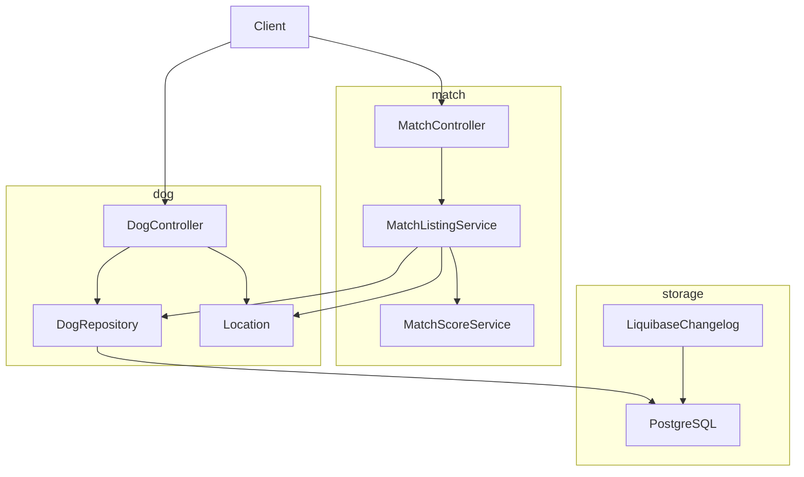
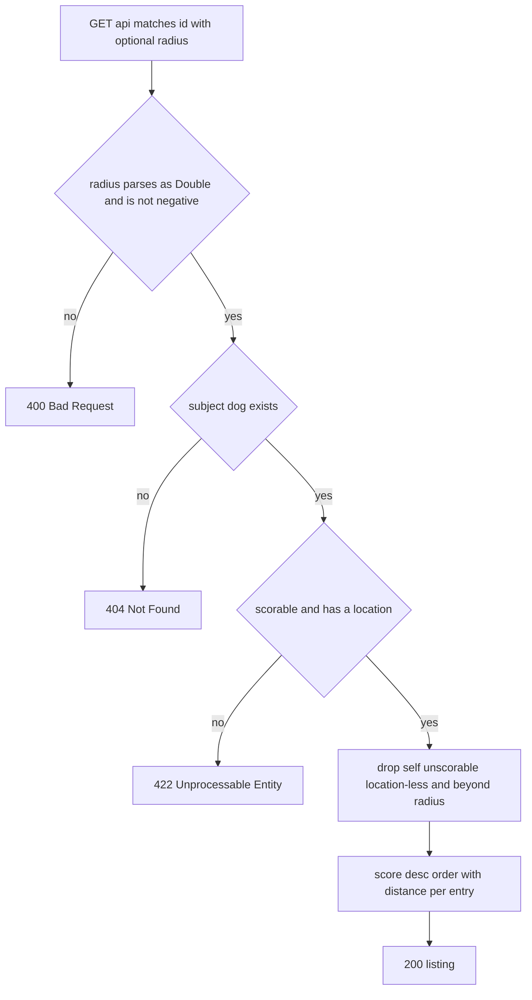

# Design Document: nearby-dog-matches

## Overview
**Purpose**: This feature delivers location-aware match discovery to dog owners: profiles gain an optional location, and the ranked match listing shows only dogs within a radius of the subject dog, ordered by match score with each entry's distance reported.
**Users**: Dog owners creating and reading profiles (with locations), and owners asking "which dogs near mine suit it best?".
**Impact**: The dog table gains two nullable columns; `DogController` gains location handling on create/read plus one new endpoint; the listing logic moves out of `MatchController` into a new `MatchListingService`, which resolves two inconsistencies `structure.md` already documents (domain logic in the controller; `MatchResponse` meaning two things).

### Goals
- Dog profiles carry an optional location, settable at creation and editable later, validated for coordinate range (1.1–1.9).
- `GET /api/matches/{id}` returns only candidates within an optional radius (default 25 km, boundary-inclusive) of the subject dog's location (2.1–2.5, 3.1–3.3).
- The listing keeps score ordering, reports each entry's distance, and preserves every existing guarantee (4.1–4.3, 5.1–5.4).

### Non-Goals
- The pairwise endpoint `GET /api/matches/{aId}/{bId}` — unchanged, no radius, no distance.
- Any change to scoring rules, weights, or the `[0.0, 1.0]` scale (`MatchScoreService` untouched).
- Client geolocation, route/travel distance, editing non-location attributes, clearing a stored location.
- Centralized error handling (`@ControllerAdvice`), auth, Jackson 2→3 migration, fixing the broken `mise run format` task.

## Boundary Commitments

### This Spec Owns
- The location data model on the dog profile: `Location` value object, `dog.latitude`/`dog.longitude` columns, and their Liquibase changesets.
- The dog API surface for location: create/read echo rules, `PUT /api/dogs/{id}/location`, coordinate range validation.
- The nearby listing rules: radius semantics (default 25 km, inclusive, zero allowed), eligibility chain (self, unscorable, location-less, beyond-radius), distance computation, ordering, and the `ListingResult` contract between service and controller.
- The listing response DTO `NearbyMatchResponse`; the demo seed backfill of locations.

### Out of Boundary
- Scoring rules and weights — consumed via `MatchScoreService`, never modified.
- The pairwise match endpoint and its response shape.
- Database-level integrity for coordinates (no CHECK constraints); rows with out-of-range imported coordinates produce garbage distances but no crash — consistent with the codebase's app-layer-validation philosophy.
- Concurrency control on dog rows (no optimistic locking; concurrent location edits may lose updates).
- HTTP behavior of `require` failures elsewhere in the system (they remain unstructured 500s).

### Allowed Dependencies
- Package direction stays one-way: `match` → `dog`. Nothing in `dog` may import from `match`.
- Runtime dependencies: **unchanged**. No new libraries; no PostGIS/earthdistance; no `@ControllerAdvice`.
- Test scope gains exactly one dependency: `spring-boot-starter-webmvc-test` (Boot 4's module for `@WebMvcTest`).
- Controllers depend on their services and repositories; `MatchListingService` depends on `DogRepository` and `MatchScoreService` (constructor injection only).
- Schema changes only through new append-only Liquibase changesets in plain SQL; changesets 001–004 are immutable.

### Revalidation Triggers
- `ListingResult` or `NearbyMatch` shape changes — the controller contract breaks.
- `dog` table column changes — startup fails via `ddl-auto: validate`.
- `DogRequest`/`DogResponse` or listing response shape changes — API consumers must re-check.
- A change to `DEFAULT_RADIUS_KM` — client-visible default behavior changes.
- Any change that lets `dog` import from `match` — dependency direction violation.

## Architecture

### Existing Architecture Analysis
Vertical slices per concept (`dog/`, `match/`), JPA over PostgreSQL with Liquibase as the sole schema authority, controllers as HTTP translators, domain rules in services with `require` and a total predicate (`canScore`) beside the partial function (`score`). The listing endpoint currently orchestrates selection and ordering inside `MatchController` — a documented inconsistency this design removes while extending. The whole HTTP and persistence surface is untested; this design adds the `@WebMvcTest` slices steering prescribes.

### Architecture Pattern & Boundary Map

Key decisions: `MatchListingService` is the single owner of listing rules (new component — the rules are new and steering demands they not live in the controller); `Location` is owned by `dog` and consumed read-only by `match`; all persistence stays behind `DogRepository`.

### Technology Stack

| Layer | Choice / Version | Role in Feature | Notes |
|-------|------------------|-----------------|-------|
| Backend | Kotlin 2.3, Spring Boot 4.1 (servlet MVC) | Controllers, service, DTOs | No new starters at runtime |
| Persistence | Spring Data JPA / Hibernate 7 | `Location` embeddable on `Dog` | `ddl-auto: validate` must pass |
| Schema | Liquibase, plain SQL changesets | 005-add-dog-location (columns, file `006`), 007 (seed backfill) | Append-only, explicit rollbacks |
| Database | PostgreSQL 18 | `dog.latitude`, `dog.longitude` nullable DOUBLE PRECISION | No extensions, no CHECKs |
| JSON | Jackson (project currently resolves the Kotlin module on the Jackson 2 path) | `@JsonInclude(NON_NULL)` on `DogResponse.location` | Annotation package works for both Jackson generations |
| Test | JUnit 5, AssertJ, `@WebMvcTest` via `spring-boot-starter-webmvc-test` (new, test scope) | Service unit tests, controller slices | `@MockitoBean` (Boot 4 removed `@MockBean`) |

## File Structure Plan

```
src/main/kotlin/com/ai4dev/tinder4dogs/
├── dog/
│   ├── Dog.kt                    [modified] + embedded nullable location; Location value object lives here (as Gender does)
│   ├── DogRepository.kt          [unchanged]
│   └── DogController.kt          [modified] location on DogRequest/DogResponse; PUT /api/dogs/{id}/location; LocationRequest, LocationResponse
└── match/
    ├── MatchController.kt        [modified] listing endpoint delegates to MatchListingService; NearbyMatchResponse; pairwise endpoint untouched
    ├── MatchScoreService.kt      [unchanged]
    └── MatchListingService.kt    [new] radius rule, distance, eligibility chain, ordering; ListingResult; NearbyMatch

src/main/resources/db/changelog/
├── db.changelog-master.yaml      [modified] appends 006 and 007
└── changes/
    ├── 006-add-dog-location.sql   [new] nullable latitude/longitude on dog (changeset id `005-add-dog-location`, unchanged)
    └── 007-seed-dog-locations.sql [new] coordinates for the six demo dogs

src/test/kotlin/com/ai4dev/tinder4dogs/
├── dog/
│   └── DogControllerTest.kt      [new] @WebMvcTest slice for the profile location surface
└── match/
    ├── MatchListingServiceTest.kt [new] unit tests of listing rules and distance (in-memory fake repository)
    ├── MatchControllerTest.kt     [new] @WebMvcTest slice for the listing endpoint
    └── MatchScoreServiceTest.kt  [unchanged]

pom.xml                           [modified] + spring-boot-starter-webmvc-test (test scope)
```
`Location` and both controller DTOs follow the existing same-file conventions (value object in `Dog.kt`, DTOs in their controller's file). Dog-side and match-side work are parallel-safe after changeset 005 exists: `match` only needs the compiled `Location` type, not the dog endpoints.

## System Flows


Flow decisions: 400 is decided before the subject is read (input shape precedes data). The two subject-level 422 conditions (unscorable, location-less) both map to 422, so their relative check order is unobservable; the sealed result type carries the distinction for logging, not for status codes. The eligibility chain orders cheap checks before scoring.

## Requirements Traceability

| Requirement | Summary | Components | Interfaces | Flows |
|-------------|---------|------------|------------|-------|
| 1.1 | Create with location → stored and echoed | Dog, Location, DogController, 005 changeset | POST /api/dogs | — |
| 1.2 | Create without location → created, location omitted | DogController (DogRequest nullable, NON_NULL inclusion) | POST /api/dogs | — |
| 1.3 | Read with location → location included | DogController (DogResponse.of) | GET /api/dogs, GET /api/dogs/{id} | — |
| 1.4 | Read without location → location omitted | DogController (NON_NULL on DogResponse.location) | GET /api/dogs, GET /api/dogs/{id} | — |
| 1.5 | Out-of-range coordinates on create → 400 | DogController (LocationRequest @field:DecimalMin/@field:DecimalMax, @Valid) | POST /api/dogs | — |
| 1.6 | Set location on a dog without one → stored, echoed | DogController, Dog, DogRepository.save | PUT /api/dogs/{id}/location | — |
| 1.7 | Replace location → stored, echoed | DogController, Dog, DogRepository.save | PUT /api/dogs/{id}/location | — |
| 1.8 | Out-of-range coordinates on update → 400 | DogController (same LocationRequest constraints) | PUT /api/dogs/{id}/location | — |
| 1.9 | Update for unknown dog → 404 | DogController | PUT /api/dogs/{id}/location | — |
| 2.1 | Omitted radius → default 25 km | MatchController (absent → DEFAULT_RADIUS_KM), MatchListingService (constant) | GET /api/matches/{id} | ListingRequest |
| 2.2 | Candidate exactly at radius → included | MatchListingService (distance <= radius) | — | EligibilityChain |
| 2.3 | Radius zero → only same-location candidates | MatchListingService | — | EligibilityChain |
| 2.4 | Negative radius → 400 | MatchController (explicit guard), MatchListingService (require) | GET /api/matches/{id} | RadiusGuard |
| 2.5 | Non-numeric radius → 400 | Spring MVC type-mismatch mapping (pinned by MatchControllerTest) | GET /api/matches/{id} | RadiusGuard |
| 3.1 | Only candidates within radius | MatchListingService (eligibility chain, haversine) | — | EligibilityChain |
| 3.2 | Candidate without location → excluded | MatchListingService | — | EligibilityChain |
| 3.3 | Subject without location → 422 | MatchListingService (SubjectWithoutLocation), MatchController | ListingResult | Eligibility |
| 4.1 | Ordered by match score, highest first | MatchListingService (sortedByDescending) | — | RankAndReport |
| 4.2 | Distance per entry in km | MatchListingService (NearbyMatch.distanceKm), MatchController (NearbyMatchResponse) | GET /api/matches/{id} | RankAndReport |
| 4.3 | id, name, score kept per entry | MatchController (NearbyMatchResponse) | GET /api/matches/{id} | RankAndReport |
| 5.1 | Subject never in its own listing | MatchListingService (id filter) | — | EligibilityChain |
| 5.2 | Unscorable candidate dropped, request survives | MatchListingService (canScore filter) | — | EligibilityChain |
| 5.3 | Unscorable subject → 422 | MatchListingService (SubjectUnscorable), MatchController | ListingResult | Eligibility |
| 5.4 | Unknown subject → 404 | MatchListingService (SubjectMissing), MatchController | ListingResult | SubjectLookup |

## Components and Interfaces

| Component | Domain/Layer | Intent | Req Coverage | Key Dependencies | Contracts |
|-----------|--------------|--------|--------------|------------------|-----------|
| Location | dog / value object | Latitude/longitude pair, present or absent as a unit | 1.1–1.9 (storage shape) | none | State |
| Dog (modified) | dog / entity | Carries the optional embedded location | 1.1, 1.2, 1.6, 1.7 | Location | State |
| DogController (modified) | dog / HTTP | Location on create/read; location edit endpoint; DTOs | 1.1–1.9 | DogRepository (P0) | API |
| MatchListingService | match / service | Radius rule, distance, eligibility chain, ordering | 2.1–2.3, 3.1–3.3, 4.1, 4.2, 5.1–5.4 | DogRepository (P0), MatchScoreService (P0) | Service |
| ListingResult / NearbyMatch | match / contract | Sealed service result and entry type | 3.3, 5.3, 5.4, 4.2, 4.3 | none | Service |
| MatchController (modified) | match / HTTP | Thin listing translation; NearbyMatchResponse; pairwise untouched | 2.1, 2.4, 2.5, 3.3, 4.2, 4.3, 5.3, 5.4 | MatchListingService (P0) | API |
| 005 / 007 changesets | storage | Nullable location columns; demo seed backfill | 1.1–1.9, 3.2 (demo) | Liquibase (external) | Batch |

### dog — Location
- **Intent**: one value object for the coordinate pair; the entity and the API never see a half-present location.
- **Requirements**: 1.1–1.9 (shape).
- **Shape**: `@Embeddable data class Location(@Column(name = "latitude") val latitude: Double, @Column(name = "longitude") val longitude: Double)` in `Dog.kt`. No-arg constructor via the existing `jpa` compiler plugin; value equality from `data class` supports tests.
- **Constraint**: no coordinate range logic here — range validation belongs to the request DTO (boundary), not the value object.

### dog — Dog (modified)
- **Intent**: persist an optional location without changing any existing field.
- **Requirements**: 1.1, 1.2, 1.6, 1.7.
- **Change**: `@Embedded var location: Location? = null` — null means "no location"; maps to the two nullable columns.

### dog — DogController (modified)
- **Intent**: own the location surface of the profile API: create/read echo and the edit endpoint.
- **Requirements**: 1.1–1.9.
- **Dependencies**: Outbound DogRepository (P0).
- **Contracts**: API.

##### API Contract

| Method | Endpoint | Request | Response | Errors |
|--------|----------|---------|----------|--------|
| POST | /api/dogs | DogRequest (existing fields + optional `location: LocationRequest?`) | DogResponse (with `location` when present) | 400 |
| GET | /api/dogs, /api/dogs/{id} | — | DogResponse (`location` omitted when null) | 404 |
| PUT | /api/dogs/{id}/location | LocationRequest (both coordinates, validated) | DogResponse (updated, `location` always present) | 400, 404 |

- `LocationRequest(latitude: Double, longitude: Double)` with `@field:DecimalMin("-90.0") @field:DecimalMax("90.0")` and `@field:DecimalMin("-180.0") @field:DecimalMax("180.0")` (the Bean Validation spec calls `@Min`/`@Max` inappropriate for floating-point types because of precision loss; boundary behaviour at exactly ±90 / ±180 must be inclusive); cascaded from `DogRequest` via `@field:Valid` (1.5, 1.8). Missing coordinates in a create-request location are rejected by Jackson/Kotlin non-null binding (400).
- `DogResponse.location: LocationResponse?` annotated for NON_NULL inclusion — absent location produces no key in the JSON body (1.2, 1.4).
- The PUT handler loads the dog (`404` when absent — 1.9), assigns the new location, saves, and returns the mapped response. Setting and replacing are the same operation, which is what makes 1.6 and 1.7 both true. Clearing is not offered.
- All mapping goes through the existing `DogResponse.of()` companion factory, extended for `location`.

### match — MatchListingService and its contract types
- **Intent**: the single owner of the nearby-listing rules; the controller becomes pure HTTP translation.
- **Requirements**: 2.1–2.3, 3.1–3.3, 4.1, 4.2, 5.1–5.4.
- **Dependencies**: Outbound DogRepository (P0) — loads subject and candidates; Outbound MatchScoreService (P0) — `score` and `canScore`, unmodified.
- **Contracts**: Service.

##### Service Interface
```kotlin
class MatchListingService(
    private val dogs: DogRepository,
    private val scores: MatchScoreService,
) {
    fun nearbyFor(subjectId: Long, radiusKm: Double): ListingResult
}

sealed interface ListingResult {
    data class Found(val entries: List<NearbyMatch>) : ListingResult
    data object SubjectMissing : ListingResult
    data object SubjectUnscorable : ListingResult
    data object SubjectWithoutLocation : ListingResult
}

data class NearbyMatch(
    val dogId: Long,
    val name: String,
    val score: Double,
    val distanceKm: Double,
)
```
- **Preconditions**: `require(radiusKm >= 0)` — the domain-invariant layer behind the controller's 400 (2.4).
- **Postconditions**: entries contain no subject (5.1), no unscorable candidate (5.2), no location-less candidate (3.2), nothing beyond `radiusKm` (2.2, 2.3, 3.1); ordered by score descending (4.1); every entry carries `distanceKm` (4.2) and id/name/score (4.3).
- **Algorithm**: load subject → `SubjectMissing` when absent (5.4); `SubjectUnscorable` when `canScore` fails (5.3); `SubjectWithoutLocation` when location is null (3.3); otherwise load all dogs, keep `id != subjectId && canScore(it) && it.location != null && distanceKm(subject, it) <= radiusKm`, map to `NearbyMatch` with the computed score and distance, sort by score descending.
- **Constants**: `DEFAULT_RADIUS_KM = 25.0` (2.1), `EARTH_RADIUS_KM = 6371.0`; distance is a private haversine function returning kilometres.
- **Implementation Notes**:
  - Integration: pure constructor injection; stateless; instantiable in tests with an in-memory fake `DogRepository` — `mise run test` stays database-free.
  - Validation: the service never validates HTTP input; it trusts its caller for shape and re-checks only the domain invariant (`radius >= 0`).
  - Risks: in-memory full scan per request matches today's behavior; fine at current scale — a repository push-down is a later, separately-reviewed change.

### match — MatchController (modified)
- **Intent**: translate the listing request to one service call and its result to HTTP; own the parameter's HTTP semantics.
- **Requirements**: 2.1, 2.4, 2.5, 3.3, 4.2, 4.3, 5.3, 5.4 (translation side).
- **Dependencies**: Outbound MatchListingService (P0).
- **Contracts**: API.

##### API Contract

| Method | Endpoint | Request | Response | Errors |
|--------|----------|---------|----------|--------|
| GET | /api/matches/{id}?radius= | optional `radius: Double?` query param | `200` with `List<NearbyMatchResponse>` | 400, 404, 422 |
| GET | /api/matches/{aId}/{bId} | — | unchanged `MatchResponse` | 404, 422 (unchanged) |

- Radius parameter: bound as `@RequestParam(required = false) radius: Double?`. Absent → `DEFAULT_RADIUS_KM` (2.1). Negative → explicit `ResponseEntity.badRequest()` (2.4). Non-numeric → Spring MVC's default `MethodArgumentTypeMismatchException` mapping, pinned by the controller slice test (2.5). No `@Validated`, no `@ControllerAdvice`.
- `ListingResult` translation: `Found` → 200; `SubjectMissing` → 404; `SubjectUnscorable` / `SubjectWithoutLocation` → 422 (indistinguishable by status, distinct in logs).
- `NearbyMatchResponse(dogId, name, score, distanceKm)` with a companion `of(NearbyMatch)` factory, replacing `MatchResponse` on this endpoint only (4.2, 4.3); `MatchResponse` remains for the pairwise endpoint.

## Data Models

### Logical Data Model
- `dog` gains `latitude DOUBLE PRECISION NULL` and `longitude DOUBLE PRECISION NULL` (changeset 005, rollback drops both). Both null or both set is enforced by the entity (`location: Location?`), not by the schema — consistent with the codebase's permissive-schema stance.
- No indexes: filtering is in-memory today; indexing cannot help until a query push-down exists.
- Existing rows — including the deliberately corrupt legacy row — remain valid; they simply have no location.

### Physical Migration (changesets)
- `006-add-dog-location.sql` (changeset id `005-add-dog-location`, unchanged so databases that already ran it are not re-migrated) — `ALTER TABLE dog ADD COLUMN latitude DOUBLE PRECISION, ADD COLUMN longitude DOUBLE PRECISION`; rollback drops both; appended to `db.changelog-master.yaml`.
- `007-seed-dog-locations.sql` — `UPDATE dog SET latitude = …, longitude = … WHERE name = …` for the six demo dogs (matching by name, as seed 003 does); rollback nulls their coordinates. Coordinates cluster around one city with at least one dog beyond the default 25 km radius so the filter is visible in the demo. The legacy row stays location-less — it keeps demonstrating 3.2 and 5.2 in every demo listing.
- Changesets 001–004 are untouched (immutability); migration runs on existing databases without downtime concerns — nullable columns, no data rewrite.

## Error Handling

| Status | Trigger | Where decided | Requirement |
|--------|---------|---------------|-------------|
| 400 | Body fails bean validation (create or location update, incl. missing coordinates) | `@Valid` on the DTO | 1.5, 1.8 |
| 400 | `radius` negative | Explicit controller guard | 2.4 |
| 400 | `radius` not parseable as Double | Spring MVC type-mismatch default (test-pinned) | 2.5 |
| 404 | Subject dog or update target absent | `ListingResult.SubjectMissing` / `Optional` empty | 1.9, 5.4 |
| 422 | Subject unscorable or without location | `ListingResult.SubjectUnscorable` / `SubjectWithoutLocation` | 3.3, 5.3 |

No centralized handler is introduced; `require` failures inside services remain out of boundary (unchanged 500 behavior).

## Testing Strategy

### Unit Tests — `MatchListingServiceTest` (no Spring context, in-memory fake `DogRepository`)
- `the default radius constant is twenty five kilometres` — pins 2.1's value at the contract level.
- `a candidate beyond the radius is excluded and one within is kept` — 3.1, using coordinates with planted separation (e.g., subject at 0,0; candidate one latitude degree away ≈ 111 km) and relation assertions, not magic numbers.
- `a candidate exactly at the subject location is included at radius zero` — 2.2 and 2.3 pinned by an exact 0.0 distance.
- `a candidate without a location is excluded from the listing` — 3.2.
- `a subject without a location is refused with SubjectWithoutLocation` — 3.3.
- `the subject never appears in its own listing` — 5.1.
- `a candidate with a corrupt age is dropped without failing the request` — 5.2 (the legacy-row scenario).
- `an unscorable subject and a missing subject are distinct results` — 5.3, 5.4.
- `entries are ordered by score from highest to lowest and each carries its distance` — 4.1, 4.2, 4.3.
- `a negative radius is rejected by require` — 2.4's service-side invariant.
- Distance behavior: same point → exactly 0; symmetric in argument order; one latitude degree ≈ 111.19 km within a tolerance — each fails on a real defect (formula sign, unit, latitude/longitude swap).

### Controller slices — `@WebMvcTest`
`MatchControllerTest` (with `@MockitoBean MatchListingService`):
- `radius omitted calls the service with the default radius` — 2.1 wiring.
- `a negative radius is rejected with 400` — 2.4.
- `a non-numeric radius is rejected with 400` — 2.5, pinning Boot 4's actual mapping rather than trusting it.
- `ListingResult cases map to 200, 404 and 422` — 5.4, 5.3, 3.3, and the 200 body shape 4.2, 4.3.

`DogControllerTest` (with `@MockitoBean DogRepository`):
- `a dog created with a location has it echoed, without one has it omitted` — 1.1–1.4 (read side via GET).
- `out-of-range coordinates are rejected with 400 on create and on location update` — 1.5, 1.8.
- `putting a location on a dog sets or replaces it and returns the updated profile` — 1.6, 1.7.
- `updating the location of an unknown dog returns 404` — 1.9.

### Why no integration/E2E tests
The HTTP and persistence surface was untested before this feature; the slices above close the HTTP side steering flagged. Full-stack flows (Liquibase, Hibernate mapping, seed) are exercised by `mise run db` + startup (`ddl-auto: validate` fails loudly on drift) — adding Testcontainers would be a test-infrastructure decision outside this spec's boundary.

## Performance & Scalability
In-memory full scan per listing request — identical cost profile to today's `bestFor`. Acceptable at the product's current scale; no caching, no indexes. Revisit trigger: dog counts where the scan is measurable; the seam for a repository push-down already exists (`MatchListingService` is the single owner, and `DogRepository` is the only data source).

## Migration Strategy
Two append-only changesets (005-add-dog-location in file `006`, and the seed backfill in `007`) run via the existing Liquibase boot hook; no application lockstep is required — nullable columns are invisible to the old code. Rollback is per-changeset and reversible (`DROP COLUMN` / `SET … = NULL`). Validation checkpoint: application starts against a migrated database with `ddl-auto: validate`; the startup failure mode for drift is loud and immediate.